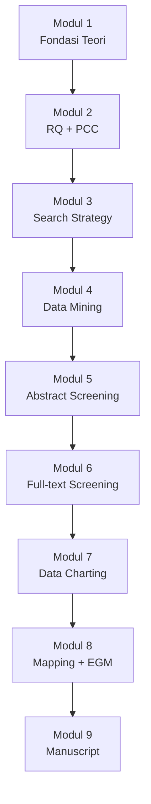

# Panduan Scoping Review dengan Generative AI

> Panduan **9-modul** untuk melakukan **Scoping Review** mengikuti **JBI Manual for Evidence Synthesis Chapter 11** (Peters et al., 2020) + standar pelaporan **PRISMA-ScR** (Tricco et al., 2018), dengan dukungan **Claude** sebagai AI assistant di setiap tahap.


**Untuk siapa?** Peneliti Indonesia yang ingin memetakan literatur secara sistematis, mengidentifikasi gap, dan menyiapkan agenda penelitian lanjutan — dengan bantuan Claude (Anthropic).


***

## 🗺️ Alur 9 Modul

## 📚 Daftar Modul

<table>
  <thead>
    <tr><th width="100">Modul</th><th>Judul</th><th>Fokus</th></tr>
  </thead>
  <tbody>
    <tr><td><a href="modul_1.md">Modul 1</a></td><td>Fondasi Teori Scoping Review</td><td>Arksey-O'Malley → Levac → JBI; PRISMA-ScR; kapan pilih ScR vs SLR</td></tr>
    <tr><td><a href="modul_2.md">Modul 2</a></td><td>Perumusan RQ dengan PCC</td><td>PCC framework, gap typology, scope justification 3-lapis</td></tr>
    <tr><td><a href="modul_3.md">Modul 3</a></td><td>Strategi Pencarian</td><td>Database peer-reviewed + grey lit (opsional), search string PCC</td></tr>
    <tr><td><a href="modul_4.md">Modul 4</a></td><td>Data Mining dan Export</td><td>Multi-source dedup, PCC-consistency preview, screening database</td></tr>
    <tr><td><a href="modul_5.md">Modul 5</a></td><td>Title/Abstract Screening</td><td>Dual-reviewer + Claude, Cohen's kappa, prinsip inklusif ScR</td></tr>
    <tr><td><a href="modul_6.md">Modul 6</a></td><td>Full-text Screening</td><td>Full-text screening, no quality exclusion (prinsip JBI)</td></tr>
    <tr><td><a href="modul_7.md">Modul 7</a></td><td>Data Charting</td><td>Iterative charting (Levac), optional non-exclusionary QA</td></tr>
    <tr><td><a href="modul_8.md">Modul 8</a></td><td>Collating, Summarizing, Reporting</td><td>Descriptive + thematic mapping + Evidence Gap Map (EGM)</td></tr>
    <tr><td><a href="modul_9.md">Modul 9</a></td><td>Manuscript Writing</td><td>PRISMA-ScR 22-item compliant, triple-track implications</td></tr>
  </tbody>
</table>

## ✨ Karakteristik Panduan



* **PCC framework** (Population–Concept–Context), bukan PICO
* **Charting** (bukan extraction) dengan refinement iteratif per Levac et al.
* **Quality Assessment OPSIONAL** dan non-exclusionary (sesuai JBI)
* **TIDAK ADA meta-analysis** — sintesis bersifat deskriptif + tematik + EGM
* **Triple-track implications** (research / practice / policy)
* **Grey literature opsional** — direkomendasikan jika relevan, dengan justifikasi eksplisit
* **PRISMA-ScR 22-item** untuk reporting standard
* **Protocol registration di OSF** (PROSPERO tidak menerima ScR)



Setiap modul memiliki struktur konsisten:

1. **Langkah bernomor** dengan tujuan jelas
2. **Prompt untuk Claude** — siap di-copy
3. **Tips Claude** — best practice dari pengalaman
4. **Output Template** — apa yang akan dihasilkan
5. **HASIL AKHIR** — package yang akan diteruskan ke modul berikutnya
6. **TROUBLESHOOTING** — solusi untuk masalah umum



* **Claude (Anthropic)** sebagai AI assistant utama
* Versi yang direkomendasikan: **Claude Sonnet** (200K context)
* **Human-decided, AI-assisted** — keputusan final selalu di tangan peneliti
* **Dual-reviewer + Claude** untuk screening dan charting
* **Deklarasi penggunaan AI** sebagai praktik integritas akademik



## 🚀 Cara Pakai


**Mulai dari** [Modul 1](modul_1.md) untuk memahami fondasi teori, lalu lanjut sekuensial. Setiap modul output-nya menjadi input modul berikutnya.


1. Baca **Modul 1** untuk memahami konsep ScR + perbedaannya dengan SLR
2. Setiap modul: copy prompt Claude → sesuaikan konteks penelitian → paste ke Claude
3. Keputusan final selalu human (Anda + tim reviewer), Claude sebagai AI-assistant
4. Simpan setiap "Hasil Akhir" — akan digunakan di modul berikutnya
5. Dokumentasikan semua keputusan untuk Methods section di Modul 9

## 📖 Referensi Metodologi Utama


Lima referensi ini **wajib disitasi** di manuskrip ScR Anda.


1. Arksey, H., & O'Malley, L. (2005). Scoping studies: Towards a methodological framework. _International Journal of Social Research Methodology_, 8(1), 19–32.
2. Levac, D., Colquhoun, H., & O'Brien, K. K. (2010). Scoping studies: Advancing the methodology. _Implementation Science_, 5, 69.
3. Munn, Z., Peters, M. D. J., Stern, C., Tufanaru, C., McArthur, A., & Aromataris, E. (2018). Systematic review or scoping review? Guidance for authors when choosing between a systematic or scoping review approach. _BMC Medical Research Methodology_, 18, 143.
4. Peters, M. D. J., Marnie, C., Tricco, A. C., Pollock, D., Munn, Z., Alexander, L., McInerney, P., Godfrey, C. M., & Khalil, H. (2020). Updated methodological guidance for the conduct of scoping reviews. _JBI Evidence Synthesis_, 18(10), 2119–2126.
5. Tricco, A. C., Lillie, E., Zarin, W., O'Brien, K. K., Colquhoun, H., Levac, D., Moher, D., Peters, M. D. J., Horsley, T., Weeks, L., Hempel, S., et al. (2018). PRISMA Extension for Scoping Reviews (PRISMA-ScR): Checklist and explanation. _Annals of Internal Medicine_, 169(7), 467–473.

## 🤝 Kontribusi

Repositori ini terbuka untuk masukan, koreksi, dan kontribusi. Silakan buka **Issue** di GitHub untuk diskusi atau **Pull Request** untuk perbaikan.

***

_Made with care for Indonesian Research Excellence_ 🇮🇩
